# クイックツアー

CueMol3 を起動してから、構造を読み込み、表示を整えて画像として書き出し、シーンを保存するまでの
最短の流れを追います。個々の画面の詳細は [画面構成](../ui/index.md)、
メニュー項目の詳細は [メニューリファレンス](../menu/index.md) を参照してください。

## 1. 起動する

CueMol3 を起動すると単一のウィンドウが開きます。
シーンはウィンドウ上部の**タブ**として並びます。

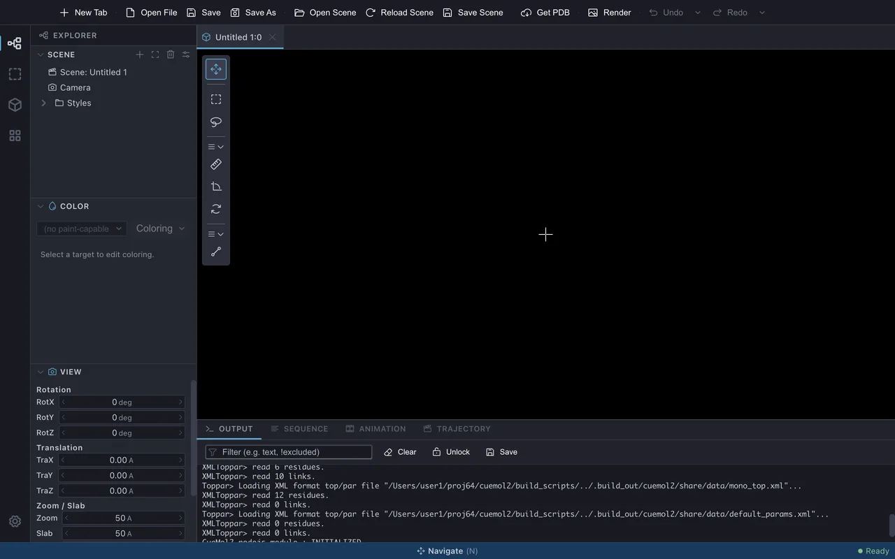{ .on-glb }

## 2. 構造を読み込む

ここでは例として、小さなタンパク質クランビン (PDB ID: **1CRN**) を読み込みます。
PDB ID がわかっている構造は、**File &gt; Get PDB...** で取得するのが最も手軽です。

1. **File &gt; Get PDB...** を選びます (ツールバーの `Get PDB` ボタンでも同じ)

    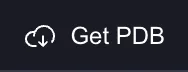{ width="94" }

2. **PDB Accession Code** に `1CRN` と入力し、**Download** を押します

    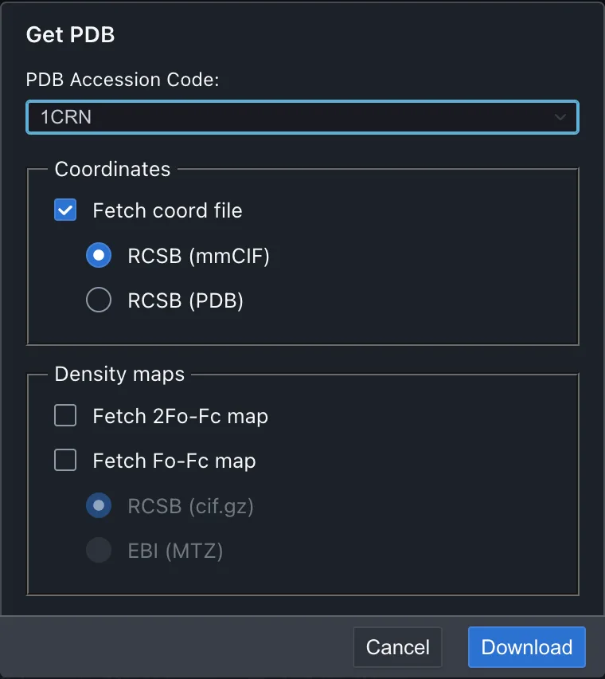{ width="380" .on-glb }

3. 読み込みのオプション画面が出るので、**Renderer type** から **simple** を選んで
   **Open** を押します

    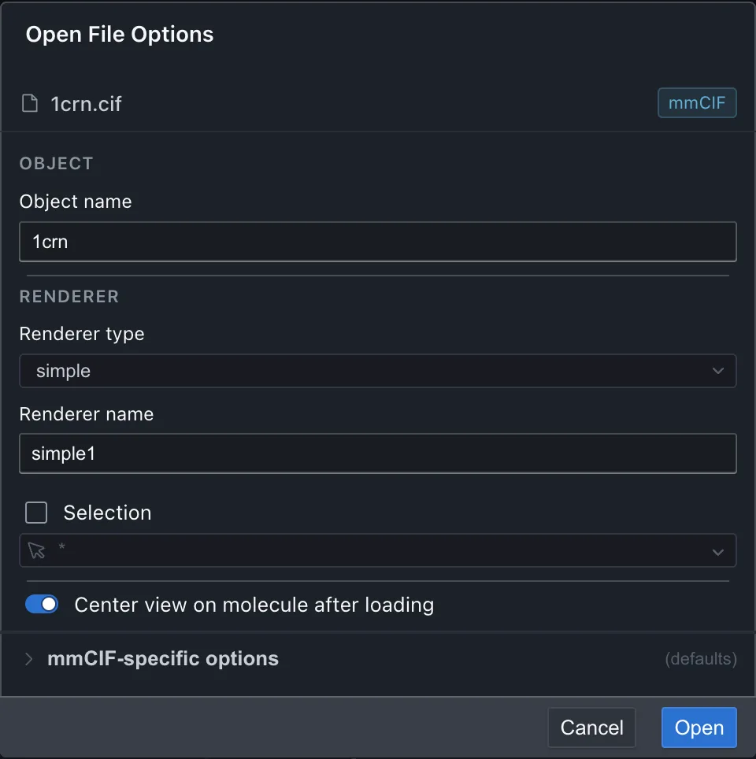{ width="480" .on-glb }

分子全体が細い線画で表示されます。simple は結合を線で描くだけの最も軽い
表示方法で、まず全体を眺めるのに向いています。

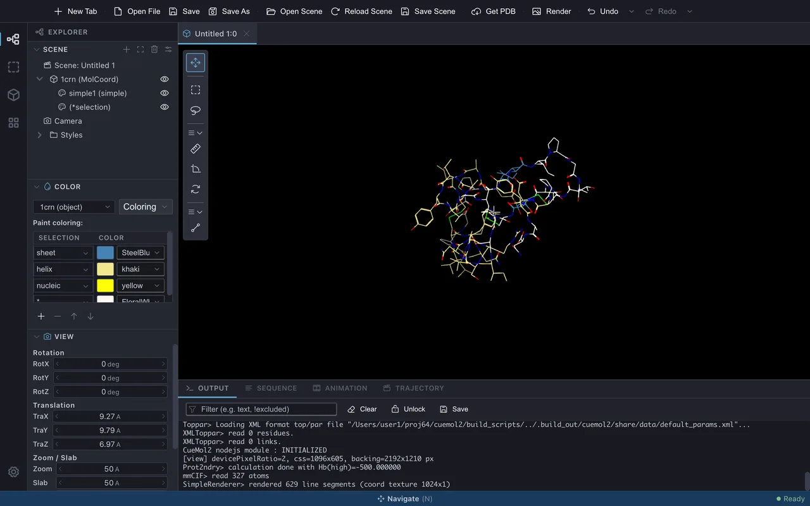{ .on-glb }

座標に加えて、電子密度マップ (RCSB の cif.gz、EBI の MTZ) も取得できます。
ダウンロードは進捗ダイアログの Cancel で中断できます。手元のファイルを開く場合は
**File &gt; Open File...** を使います (同じオプション画面が出ます)。

## 3. 表示を整える

読み込んだ構造は、**Renderer** (表示方法) を通じて**分子ビュー** (中央の 3D 表示領域) に
描かれます。1 つの Object には複数の Renderer を重ねられます。

### Renderer を追加する

二次構造がわかるように、**ribbon** を追加してみます。

1. 左サイドパネルの **Explorer &gt; Scene** ツリー (シーンツリー) で Object (`1crn`) を
   右クリックし、**New Renderer** を選びます

    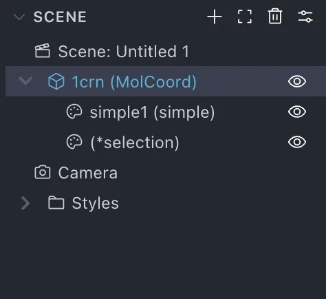{ width="237" .on-glb }

2. **Renderer type** から **ribbon** を選び、**Create** を押します

    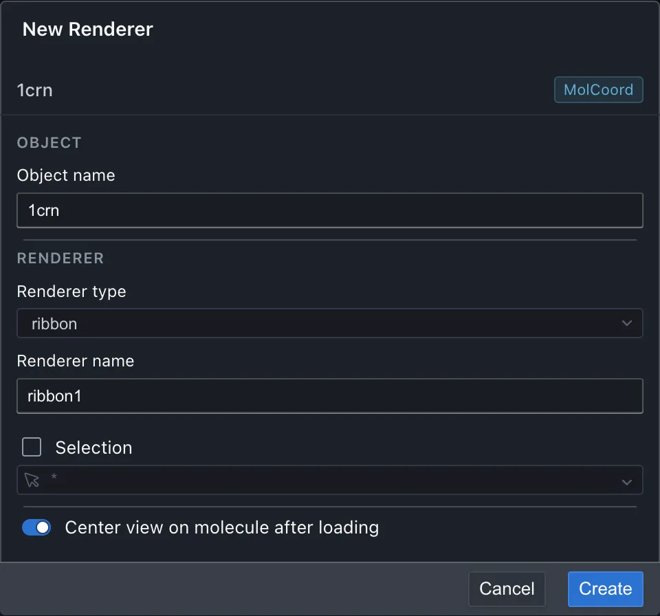{ width="480" .on-glb }

線画に重なって、ヘリックスとシートは板状のリボン、それ以外は細いチューブで
描かれます。

次に、ジスルフィド結合を作っている Cys 残基だけを **ballstick** (原子を球、結合を
円柱で描くモデル) で表示してみます。Renderer は**選択式**で対象の原子を絞り込めます
(→ [選択式の文法](../reference/selection.md))。ここでは式を手で書くかわりに、
[選択ビルダー](../ui/selection-builder.md)で組み立てます。

1. 同じ手順で Object (`1crn`) を右クリックし、**New Renderer** を選びます
2. **Renderer type** から **ballstick** を選びます
3. **Selection** にチェックを入れます
4. 選択式の欄の右端の ▼ を押して、選択ビルダーを開きます
5. **Term** タブに切り替え、キーワードから **resn** (残基名) を選びます
6. 値の欄の ▼ から候補を開き、**CYS** を選びます
7. **Set** を押します。選択式の欄に `resn CYS` と入力されます

    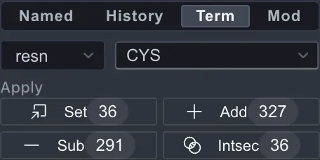{ width="228" .on-glb }

8. **Create** を押します

    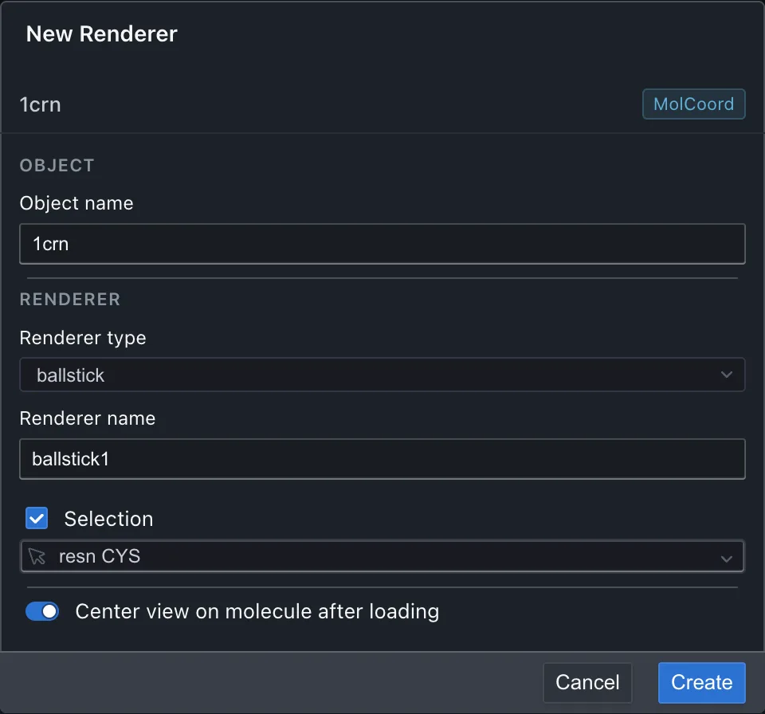{ width="480" .on-glb }

リボンに重なって、6 個の Cys 残基だけが球と円柱で描かれます。クランビンでは
これらが 3 対のジスルフィド結合を作っています。

最初の線画はもう不要なので、シーンツリーの `simple1` の行の**目のアイコン**を
クリックして非表示にします。目のアイコンでは Renderer ごとの表示・非表示を
いつでも切り替えられます。

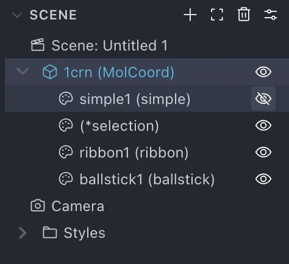{ width="237" .on-glb }

- Renderer は種類を選ぶと**すぐに既定値で作成**され、細かい設定は後から
  インスペクタで調整します (この方針は [操作パラダイムの変更](../changes/ui-paradigm.md) を参照)
- 定義済みの組み合わせ (プリセット) を選ぶと、複数の Renderer をまとめたグループが一度に作られます

### 見た目を調整する

シーンツリーで `ballstick1` を**ダブルクリック**すると、右側の**プロパティインスペクタ**に
その設定が表示されます。**Ball and stick** セクションを開き、**Atom radius**
(原子の球の半径、Å 単位) を既定の 0.3 から `0.5` に上げてみてください。
球が大きくなり、原子を強調した表示に変わります。値の変更は分子ビューに
即座に反映され、取り消したいときは ++cmd+z++ / ++ctrl+z++ で戻せます。

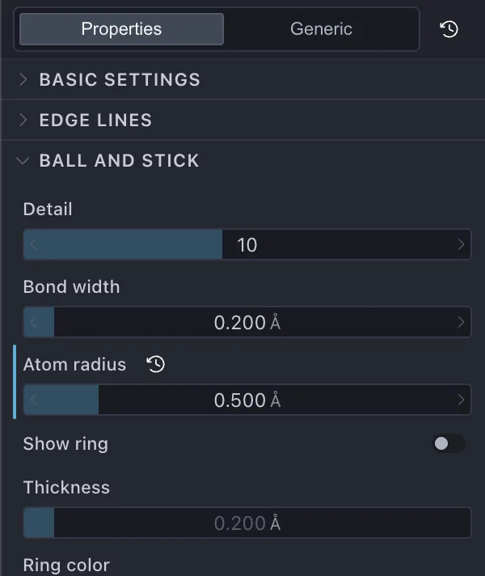{ width="300" .on-glb }

### 色を塗り替える

色は Renderer ごとに、左サイドパネルの **Explorer &gt; Color** パネルで設定します。

1. 上部で `ribbon1 (ribbon)` を選びます

    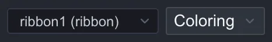{ width="233" }

2. 隣の **Coloring** ボタンを押し、**Rainbow coloring** を選びます

    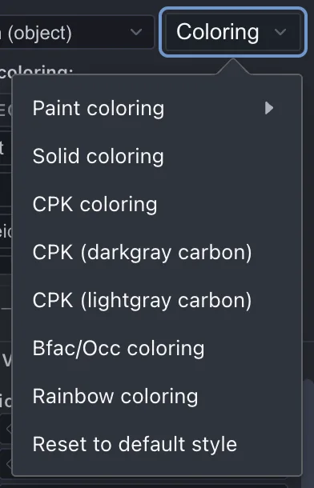{ width="196" .on-glb }

リボンが N 末端から C 末端へ虹色に塗り替わります。Coloring には Paint / CPK /
B-factor / 静電ポテンシャルなどの種類があります (→ [Coloring](../reference/coloring.md))。

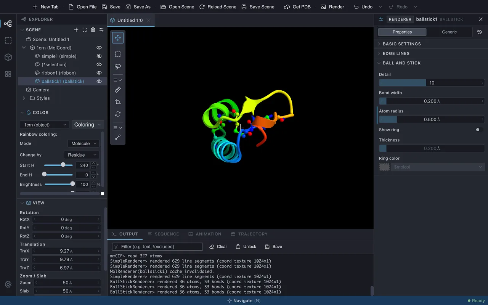{ .on-glb }

### 視点を動かす

分子ビュー上でのマウス操作は次のとおりです (既定値)。

| 操作 | 動作 |
|---|---|
| 左ドラッグ | 回転 |
| ホイール | ズーム |
| トラックパッドの 2 本指スクロール | 平行移動 (ポインティングデバイス設定が Mac trackpad / Auto-detect のとき) |

詳細と設定変更は [マウス・トラックパッド操作](../ui/mouse-input.md) を参照してください。

## 4. 画像を書き出す

用途に応じて 2 通りあります。

### 手軽に画面のまま出す

**Rendering &gt; Export scene &gt; PNG image...** を選ぶと、保存先とサイズ・DPI・背景の透過を指定して
PNG を書き出せます。

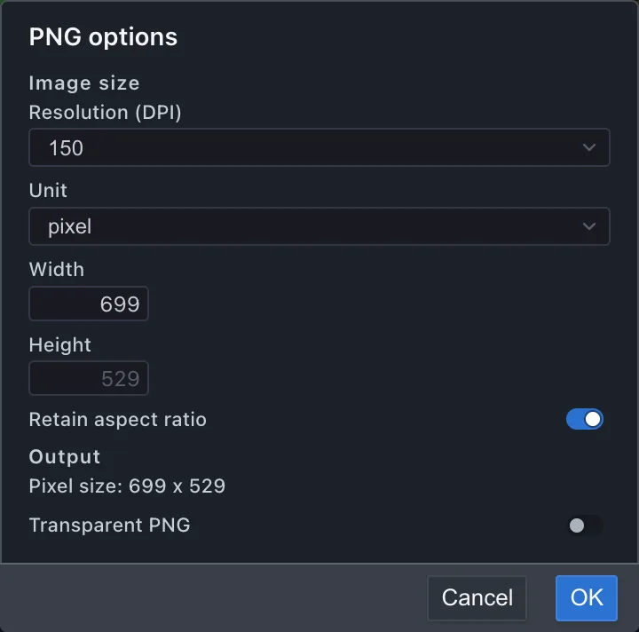{ width="360" .on-glb }

### 高品位なレイトレース画像を出す

**Rendering &gt; Image rendering...** を選ぶと、独立した**レンダリングウィンドウ**が開き、
静止画 (Still) モードになります。

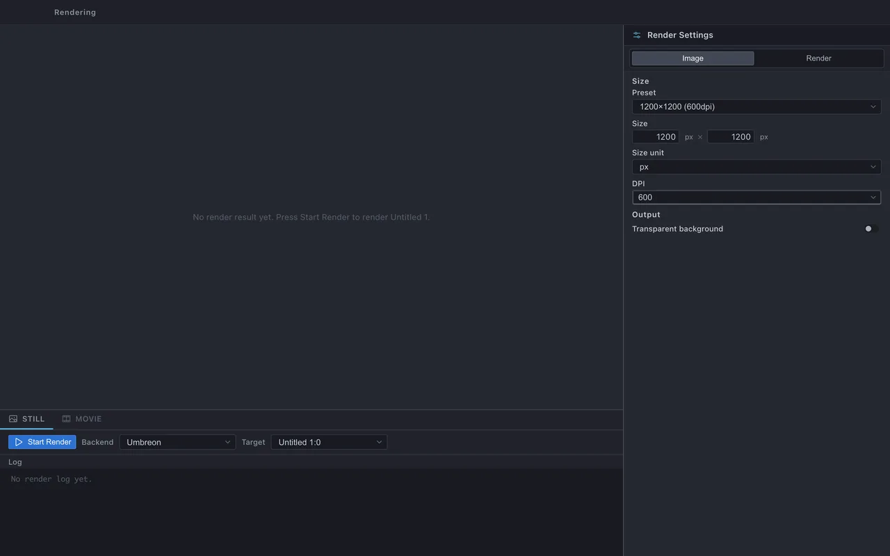{ .on-glb }

1. 対象のビュー (Target) を選ぶ。バックエンドは既定の **Umbreon** のままで構いません

    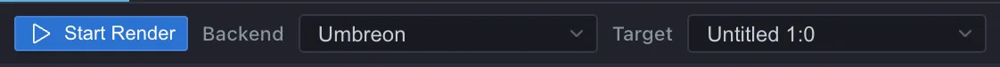{ width="561" .on-glb }

2. 画質・サイズを設定する

    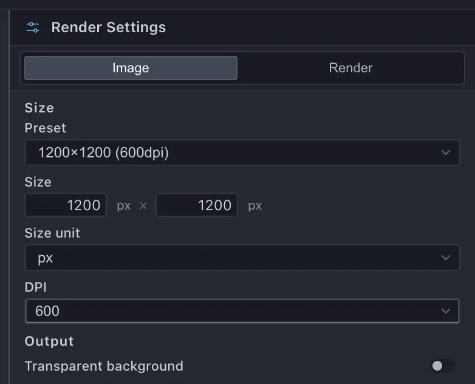{ width="307" .on-glb }

3. **Start Render** を押すと、進捗が表示され、完了すると結果画像が同じウィンドウに表示されます

    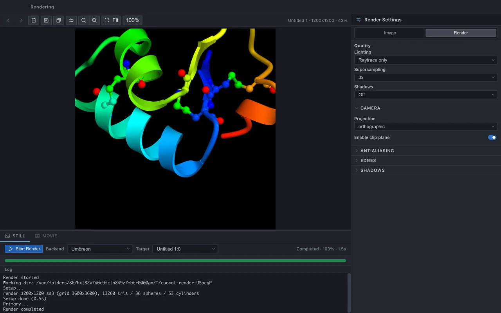{ .on-glb }

動画を作る場合は **Rendering &gt; Movie rendering...** で同じウィンドウの Movie モードを使います
(→ [レンダリングウィンドウ](../ui/rendering-window.md))。

## 5. シーンを保存する

**File &gt; Save Scene** (++cmd+s++ / ++ctrl+s++) でシーンを `.qsc` ファイルに保存します。
初めての保存では **Save Scene As...** と同じく保存先とオプション (埋め込み / 互換性 / 圧縮 / エンコーディング) を
指定する画面が出ます。

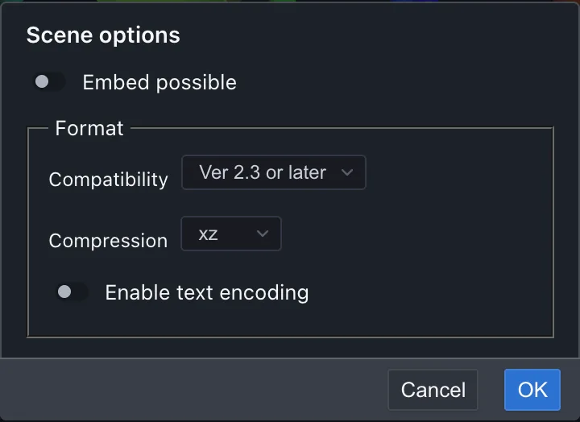{ width="360" .on-glb }

`.qsc` は CueMol2 と互換のため、CueMol2 で作成したシーンを CueMol3 で開くこともできます。

## 次のステップ

- [チュートリアル](../tutorials/index.md) — 目的別の作図手順をひととおり
- [画面構成](../ui/index.md) — 各パネルの役割を詳しく
- [メニューリファレンス](../menu/index.md) — 全メニュー項目の一覧
- [CueMol2 からの変更点](../changes/index.md) — CueMol2 経験者向け

---

*確認対象: CueMol3 2.3.8.495*
