# cartoon (カートゥーン)

タンパク質専用の Renderer で、ヘリックスを筒状、シートを板状、コイルをチューブ状に
表示します。対象 Object: 分子 (MolCoord)。実装クラスは Ribbon2Renderer です。

表示は [ribbon](ribbon.md) と似ていますが、既定でβシート以外は基本的に Cα 原子を
通るように表示される ribbon とは異なり、分子のフォールドのみを強調するように
スムージングされた表示になります (後述の Smoothing や Anchor を設定することで
強制的に通らせることもできます)。

下図は cartoon (左) と ribbon (右) を同じ分子について既定のパラメータ値で表示させた例です。

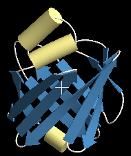{ .on-glb }
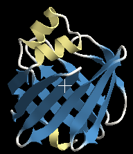{ .on-glb }

## プロパティ

共通プロパティは [Renderer 共通プロパティ](common.md) を参照してください。
断面形状 (Section type / Section width / Tuber / Sharpness) の意味は
[ribbon](ribbon.md#helix) と共通です。

### Cartoon

Axial detail
:   鎖方向のポリゴン分割数

Smooth color
:   隣り合う残基間の着色をグラデーションにするかどうか

Pivot atom name
:   主鎖表示が通る原子の名前 (既定は CA)

Start cap / End cap
:   末端の形状 (sphere / flat / none)

Anchor selection
:   Cα をできるだけ通らせたい残基の[選択式](../selection.md)。
    cartoon 表示に側鎖を生やした場合、主鎖表示が Cα の位置を通らないため側鎖が
    宙に浮いたようになります。この場合に効果があります。 
    下図は Coil の Smoothing = -1 (既定) で、ループ先端部分の残基 `A.76.*` を
    Anchor selection に指定した場合です 
    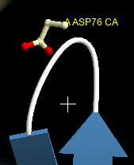{ .on-glb }
    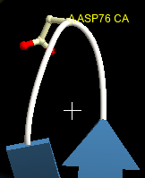{ .on-glb } 
    ループやシート中に 1 残基程度なら効果的に働きますが、多くなると結局
    Smoothing を小さくした場合と同じになるので、多くの Cα 原子を通らせたい場合は
    Smoothing を調整するほうが適しています

Anchor weight
:   Anchor selection で指定した残基を Cα に引き寄せる強さ

### Helix

Smoothing
:   ヘリックスのシリンダーの滑らかさを実数値で指定します。既定は 3.0 でかなり直線的です。

    - 減少させると Cα に沿ったらせん状に近づく
    - 増加させるとほぼ直線になる

    下図は左から 1.0、2.0、4.0 の場合です 
    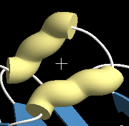{ .on-glb }
    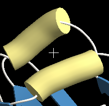{ .on-glb }
    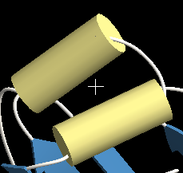{ .on-glb } 
    4 以上になるとほぼ直線であまり違いは出ません。1 以下にするとおひねりのような
    形状になります。負の値や小数値も指定できますが、妥当な使用範囲は 2〜4 程度です

Width mode
:   既定ではシリンダーの太さは平均値で一定になります。
    これを切り替えると、シリンダーの中心線から Cα 原子のはずれ具合に合わせて
    太さが変わるようになります

Width smooth
:   Width mode を可変にした場合のみ有効で、シリンダーの太さの滑らかさを指定します。
    大きい値ほど滑らかになります。既定は 5.0 で、これだと太さ一定の場合と
    ほとんど変わりませんが、小さくすることで太さの変化が現れます。 
    下図は 0.0、1.0、2.0 に変化させた場合です (他は可変幅、Smoothing = 3.0 で固定) 
    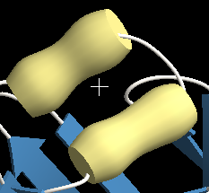{ .on-glb }
    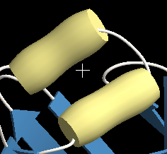{ .on-glb }
    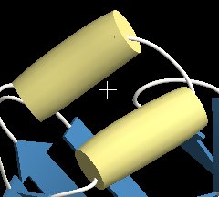{ .on-glb } 
    Smoothing の値によっても見え方が大きく変わります

Add width
:   構造によっては、ヘリックスのシリンダーとコイルのつなぎ目でコイル部分が
    はみ出してしまう場合があります。この値を増やすとその分シリンダーの半径が
    増えるので、うまく隠れるように調整できます。 
    下図は 0.0、0.5 の場合です 
    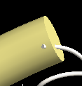{ .on-glb }
    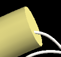{ .on-glb } 
    既定値はコイルの太さ 0.2 と同じで、たいていの場合は隠れます。
    意図的に負の値を指定して細いシリンダー表示にすることもできます

Extend
:   ヘリックス区間を前後に延長する量

### Sheet

Smoothing
:   シート表示の滑らかさ。既定値は 3.0 で、シートの曲がり具合の特徴を捉えながらも
    ある程度まっすぐになる設定です。 
    下図は -5.0、0.0、3.0 の場合です。-2 以下にするとおおよそ Cα を通るようになり、
    3 以上にするとほぼ直線状になります 
    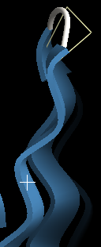{ .on-glb }
    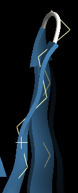{ .on-glb }
    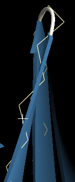{ .on-glb }

Width smooth
:   シートの幅の変化の滑らかさ

### Coil

Smoothing
:   コイル表示の滑らかさ。既定値は -1.0 で、コイルの曲がり具合の特徴を捉えながらも
    すっきりとした見栄えになる設定です。 
    下図は -5.0、-2.0、-1.0、0.0 の場合です。-2 以下にするとおおよそ Cα を通り、
    0 以上にすると実際の Cα 位置から乖離しすぎる場合があります 
    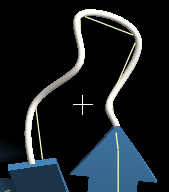{ .on-glb }
    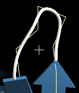{ .on-glb }
    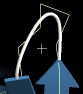{ .on-glb }
    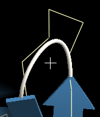{ .on-glb }

## 制限

- 選択式で二次構造の途中から表示させると、意図したように表示されない場合があります。
  部分表示させるときはコイルの部分で切れるように調節してください。

!!! note "断面形状の詳細設定について"
    断面形状 (TubeSection) と接続部 (JctTable) の一部のプロパティは、
    Properties タブではなく **Generic** タブから編集します
    (→ [プロパティインスペクタ](../../ui/inspector.md))。

## 関連項目

- [Renderer の一覧](index.md)
- [ribbon](ribbon.md) — Cα を通る古典的なリボン表示
- [マテリアル](material.md) / [エッジライン](edge-lines.md)

---

*最終確認: 2026-08-11 / 確認対象: 開発版 (tritium)*
