# disorder

タンパク質・核酸のディスオーダー領域の主鎖を表示するための Renderer です。
対象 Object: 分子 (MolCoord)。

結晶構造でディスオーダーして見えていない部分を、[ribbon](ribbon.md) などの主鎖表示に
滑らかにつながる点線 (ベジエ曲線) として表示できます。

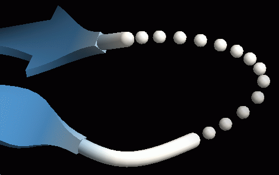{ width="320" .on-glb }

!!! note "作成できるのは Object がシーンに入ってからです"
    disorder は単独では機能せず、対象となる主鎖 Renderer を必要とします。
    そのため、ファイルを開くときの Renderer type の一覧には表示されません。
    New Renderer ダイアログからは作成でき、そのときシーンにある
    tube / ribbon / cartoon / nucl のうち最初のものが Target に設定されます。

## ディスオーダー領域の判定

同じチェインに含まれているのに残基番号が連続していない (ribbon などで主鎖表示が
分断される) 場合に、その間がディスオーダーしていると判定され、
点線表示の対象になります。前後でチェインが違っている場合は表示されません。

## 色

色の設定は他の Renderer と同様に [Color パネル](../coloring.md)で行います。
色はディスオーダー領域の両端の残基の色で着色され、
両端で色が異なる場合は両方の色の間でグラデーションになります。

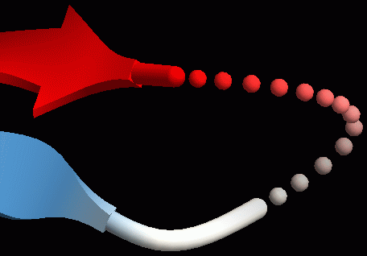{ width="320" .on-glb }

## プロパティ

共通プロパティは [Renderer 共通プロパティ](common.md) を参照してください。

選択式 (`sel`) を指定して表示部分を制限できます。既定では `*` で分子中の
ディスオーダー領域すべてが対象ですが、たとえば `A.1:100.*` に変更すると、
チェイン A の残基番号 1〜100 の範囲内にあるディスオーダー領域のみが対象になります。
これを使って 1 つの分子に複数の disorder Renderer を付け、点線の形状を変えられます。
下図は右と左のディスオーダー領域に別々の Renderer を作成し、
ドットの大きさと間隔を変えた例です。

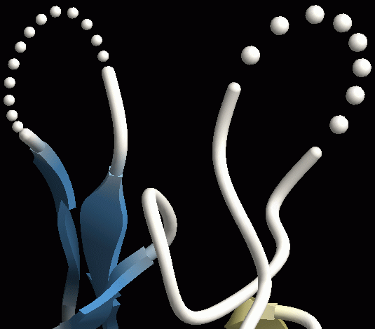{ width="320" .on-glb }

他の Renderer 同様、[エッジライン](edge-lines.md)による輪郭線や、
[マテリアル](material.md)を nolighting (べた塗り) に変更することもできます。

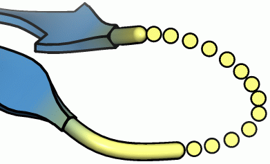{ width="320" .on-glb }

### Disorder

Target
:   ディスオーダー領域の点線を表示する対象の Renderer。作成時には、その時点で存在する
    ribbon / cartoon / nucl などの Renderer から自動的に選ばれます。
    意図しない Target が選ばれている場合はここで変更します

Detail
:   点線の点 (球) のポリゴン分割レベル。大きいほど細かく滑らかになります

Dot size
:   点線の点 (球) の大きさ。既定は 0.3。下図左は 0.1、右は 0.5 にした場合 
    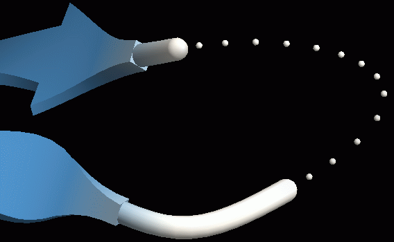{ width="200" .on-glb }
    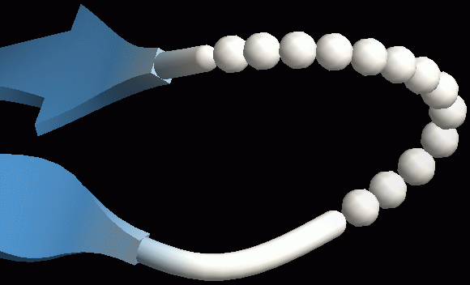{ width="200" .on-glb }

Dot separation
:   点線の間隔。下図左は 0.6、右は 1.8 にした場合 
    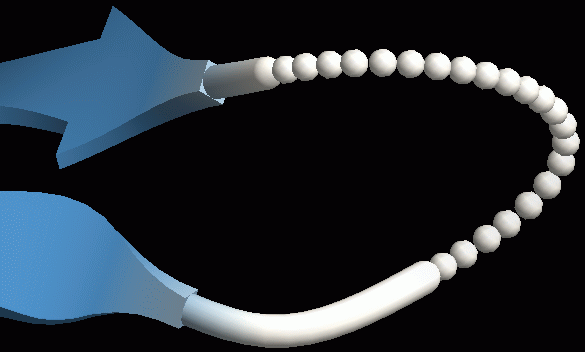{ width="200" .on-glb }
    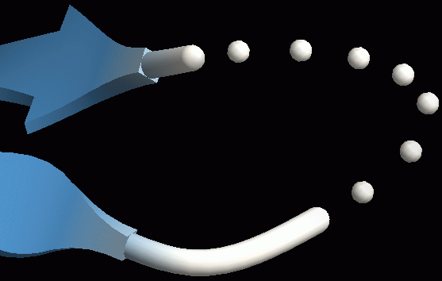{ width="200" .on-glb }

Loop size
:   ディスオーダー部分と主鎖のつながり方。大きい値にするとより滑らかに、
    飛び出した形になります (ベジエ曲線の制御点の位置に影響します)。既定値は 2.0。
    下図左は 1.0、右は 6.0 にした場合 
    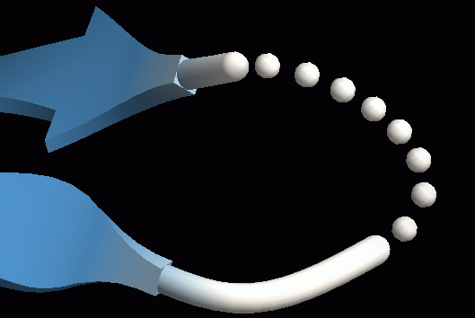{ width="200" .on-glb }
    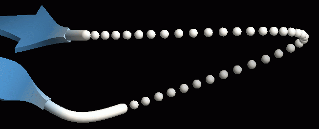{ width="200" .on-glb }

Loop size 2
:   ディスオーダー部分と C 末端側主鎖 (タンパク質の場合) のつながり方。
    既定では -1 で、この場合 N 末端・C 末端とも Loop size の値が使われます。
    0 以上の値を指定すると、Loop size が N 末端側、Loop size 2 が C 末端側の
    接続の滑らかさになります。 
    下図は Loop size = 0.5、Loop size 2 = 4 にした場合です。N 末端側 (手前のβシート側)
    は非常に小さいので折れ曲がったように不連続になっていますが、
    C 末端側 (奥のβシート側) は大きいので滑らかに接続されています 
    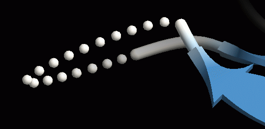{ width="320" .on-glb }

Color
:   既定色

## 関連項目

- [Renderer の一覧](index.md)
- [ribbon](ribbon.md) / [cartoon](cartoon.md) / [nucl](nucl.md) — Target になる主鎖 Renderer
- [マテリアル](material.md) / [エッジライン](edge-lines.md)

---

*確認対象: CueMol3 2.3.12.517*
