# エッジライン

描画された物体の輪郭に線 (エッジ線) を描き加える設定です。
すべての Renderer の共通プロパティとして、プロパティインスペクタの **Common**
セクションから設定します。

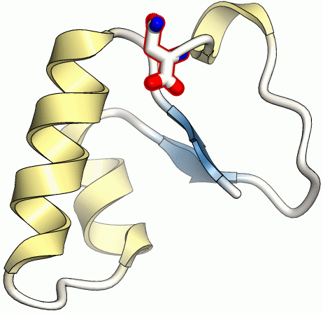{ width="280" .on-glb }
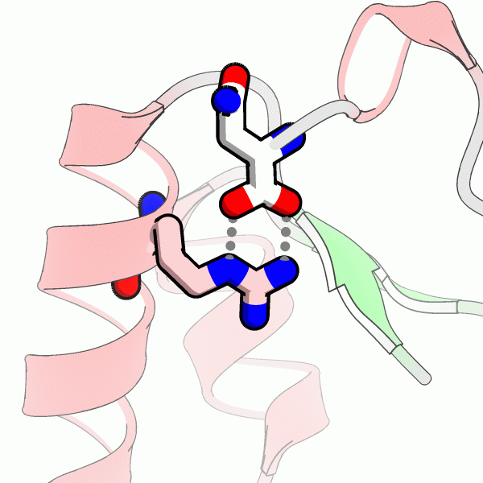{ width="280" .on-glb }

!!! note "分子ビューにも反映されます"
    エッジラインは、分子ビュー (リアルタイム表示) と
    [レンダリング](../rendering.md)結果の**両方**に描かれます。
    描画の方式は異なりますが、できるだけ同じ見た目になるように調整されています。
    細部は完全には一致しないため、最終的な仕上がりはレンダリング結果で確認してください。

## プロパティ

### Edge type

None
:   エッジ線なし (既定)

Edges
:   エッジ線を表示します

Silhouette
:   シルエット線を表示します。輪郭の部分のみ線が描かれます

各設定での線は下図のようになります。

- Edges (0.06 Å) 
  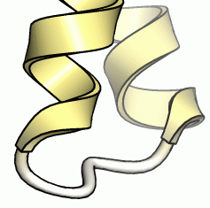{ .on-glb }
- Silhouette (0.03 Å) 
  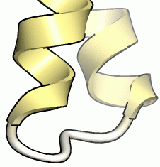{ .on-glb }

### Width

線の太さを **Å 単位**で指定します。単位がピクセルではないため、
レンダリング時のイメージのサイズを大きくすると、それに応じて線も太くなります。

よく使う太さの目安は次のとおりです。

| 太さ | 値 | 表示例 |
|---|---|---|
| ふつう | 0.06 Å | { width="160" .on-glb } |
| 太め | 0.15 Å | 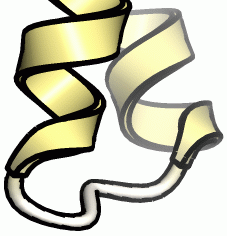{ width="160" .on-glb } |
| 細め | 0.03 Å | 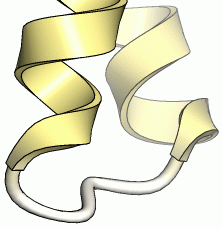{ width="160" .on-glb } |

### Color

線の色を指定します。通常は黒にすることが多いですが、
黒背景に白線など任意の色を指定できます。

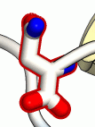{ .on-glb }
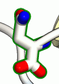{ .on-glb }
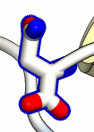{ .on-glb }

## エッジ線の精度と detail 値

どの程度正しくエッジ線が抽出されて描画されるかは、Renderer のポリゴン分割数
(detail 値) に大きく依存します。下図は線の太さ 0.1 Å で、左から順に
[ballstick](ballstick.md) の detail 値を 2、5、10、20 と増加させた例です。

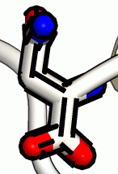{ .on-glb }
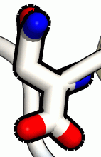{ .on-glb }
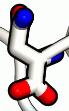{ .on-glb }
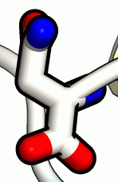{ .on-glb }

detail 値が大きいほど線がきれいに連続的に描画されます。detail 値が小さいと
線がとぎれとぎれになる傾向があり、これは線が太いほど目立ちます。
線を太くする場合は detail 値も大きくしてください。

ballstick の detail 既定値は 5 ですが、上の例からは、線の太さが 0.1 Å の場合は
10 以上にしたほうがよいことがわかります。

## スタイルによる一括指定

エッジラインの設定はスタイルとしても用意されており、
シーンツリーの右クリックメニューからまとめて適用できます
(→ [スタイル](../styles.md))。

<!-- TODO(verify): tritium のスタイル一覧に Edge line (normal/thick/thin) 相当が
     現存するか。default_style.xml で確認して具体名を記載する -->

## 関連項目

- [Renderer 共通プロパティ](common.md)
- [マテリアル](material.md)
- [レンダリング](../rendering.md) — バックエンドと品質の設定
- [レンダリングウィンドウ](../../ui/rendering-window.md)

---

*確認対象: CueMol3 2.3.7.489*
