# nucl (核酸)

RNA・DNA などの核酸専用の Renderer です。対象 Object: 分子 (MolCoord)。
[tube](tube.md) と同様の主鎖チューブ表示に加え、塩基残基をスティック状などの
さまざまな形状で表示できます。

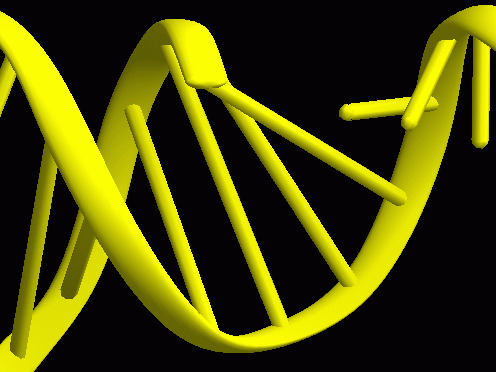{ width="320" .on-glb }

## プロパティ

共通プロパティは [Renderer 共通プロパティ](common.md) を参照してください。

### Nucleic acid

Show tube
:   主鎖チューブを表示するかどうか。チューブ表示を OFF にし、別の
    [tube](tube.md) Renderer で主鎖を表示することで、より複雑な表示ができます。
    下図左は Show tube を OFF にした状態、右は別の tube Renderer で 2 種類の
    異なる主鎖表示を組み合わせた例です 
    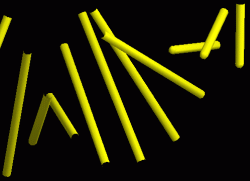{ width="240" .on-glb }
    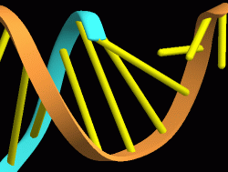{ width="240" .on-glb }

Connect base pair
:   残基が塩基対を形成している場合、2 つの残基を 1 本のスティックで表示するか (ON)、
    2 本の別々のスティックで表示するか (OFF)。下図は OFF にした場合です 
    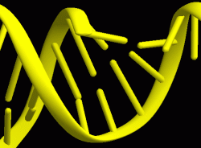{ width="240" .on-glb }

Base type
:   塩基部分の表示形状。

    **basepair**
    :   残基をスティック状に表示するモード (既定)

    **simple1**
    :   basepair 同様にスティック状に表示されますが、塩基と糖の N-グリコシド結合の
        ところで折れ曲がった形状になります。下図左は Connect base pair = ON、右は OFF 
        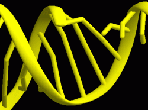{ width="220" .on-glb }
        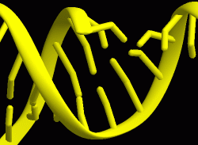{ width="220" .on-glb }

    **detail1**
    :   塩基の部分が板状に表示されるモード (塩基対形成による表示変化はありません) 
        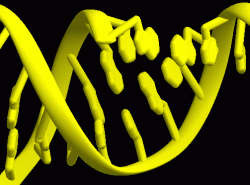{ width="220" .on-glb }
        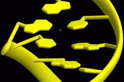{ width="220" .on-glb }

    **detail2**
    :   detail1 に加えて、リボースの部分も板状に表示されるモード 
        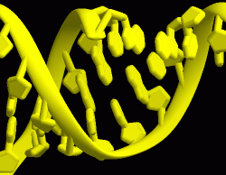{ width="220" .on-glb }
        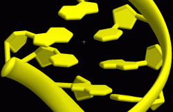{ width="220" .on-glb }

Detail
:   残基の表示の緻密さ。大きいほど滑らかな表示になりますが、ポリゴン数が増え
    処理が重くなります。レイトレーシング時には、
    [エッジライン](edge-lines.md)を使用する場合を除いて無視されます

Base size
:   残基表示の大きさ。スティック状の部分のシリンダーの半径を Å 単位で指定します

Base thick
:   Base type が detail1 / detail2 の表示において、板状に表示された塩基などの厚さ。
    100% だと板の厚さとスティックの太さが同じになり、たとえば 50% にすると
    板の厚さは半分になります (下図は detail2 の場合) 
    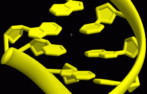{ width="240" .on-glb }

### Tube / Section / Putty

主鎖表示は [tube](tube.md) と同じなので、設定内容もそちらと共通です。
nucl で変更することの多い項目のみここに示します。

Pivot atom name
:   チューブが通る原子の名前。既定は P (主鎖リン酸のリン原子) ですが、
    これだとチューブが実際の残基よりも大回りしすぎる傾向があります。
    場合によっては C5' (リボースの 5' 位炭素) などに変更したほうが見栄えが
    よくなることもあります (特に Base type に依存します) 
    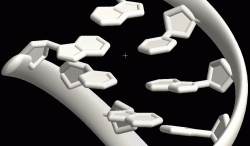{ width="280" .on-glb }

## 塩基対の判定

PDB ファイル読み込み時に構造がチェックされ、ある 2 残基がワトソン・クリック塩基対を
形成していると判定されると、自動的に塩基対を形成しているとマークされます。
判定には水素結合距離と 2 塩基同士の平面性が考慮されます。

nucl Renderer は、読み込み時に塩基対を形成していると判定されたものについてのみ
塩基対表示を行います。指定残基について手動で強制的に塩基対を作らせたり、
塩基対を削除したりすることはできません。

## 関連項目

- [Renderer の一覧](index.md)
- [tube](tube.md) — 主鎖チューブ表示の設定
- [マテリアル](material.md) / [エッジライン](edge-lines.md)

---

*最終確認: 2026-08-11 / 確認対象: 開発版 (tritium)*
