# ribbon

タンパク質・ポリペプチドの主鎖をスプライン曲線でリボン状に表現する Renderer です。
対象 Object: 分子 (MolCoord)。

- ヘリックスをリボン状
- シートを板状
- コイルをチューブ状

に表示します。

正しくリボン状に表示されるには、タンパク質分子に二次構造が割り当てられている必要が
あります。二次構造は通常ファイルの読み込み時に自動で割り当てられます。
手動で再割り当てする場合は Tools メニューの **Reassign secondary str...** を使います
(→ [Tools メニュー](../../menu/tools.md))。

RNA・DNA などタンパク質以外の鎖状ポリマーに対して ribbon を作成した場合は、
単に [tube](tube.md) と同様のチューブ状表示になります。

## プリセットスタイル

よく使う ribbon の設定はスタイルとして用意されています。
シーンツリーで Renderer を右クリックし、スタイルの一覧から選んで適用します
(→ [スタイル](../styles.md))。

Default
:   既定の ribbon 表示。コイルは太めのチューブ、ヘリックスとシートは断面が四角い板状のリボン (下図左)

Fancy1
:   Molscript 風の ribbon 表示。ヘリックスの内側とシートの側面は白っぽい色で塗られ、
    ヘリックスの断面はダンベル状になる (下図中央)

Round
:   コイルは細めのチューブ、ヘリックスとシートは断面が楕円状の丸みを帯びたリボン (下図右)

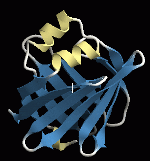{ width="240" .on-glb }
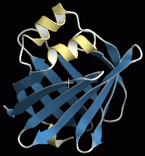{ width="240" .on-glb }
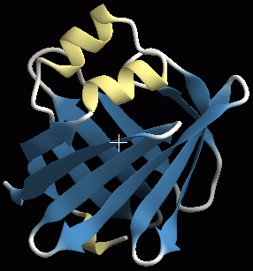{ width="240" .on-glb }

## プロパティ

共通プロパティ (名前・表示・マテリアル・エッジラインなど) は
[Renderer 共通プロパティ](common.md) を参照してください。

### Ribbon

Section detail
:   断面方向のポリゴン分割数。大きい値を指定するほど細かく分割されて表示がきれいに
    なりますが、描画速度は低下します

Axial detail
:   鎖方向のポリゴン分割数。大きい値を指定するほど細かく分割されて表示がきれいに
    なりますが、描画速度は低下します

Smooth color
:   隣り合う残基間で色が異なる場合、ON だと残基間の着色がグラデーションになり (下図左)、
    OFF だと中央で色が変わります (下図右) 
    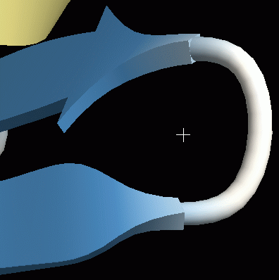{ width="240" .on-glb }
    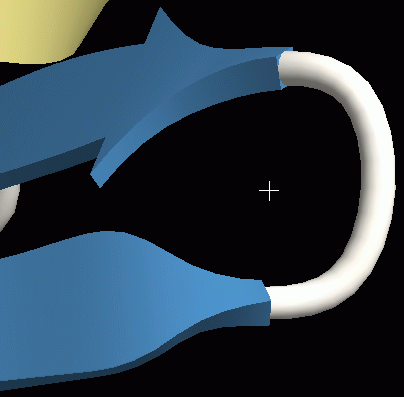{ width="240" .on-glb }

Pivot atom name
:   リボンやチューブが通る原子の名前。タンパク質の場合は既定で CA (Cα 炭素原子) に
    なっており、通常変更する必要はありません

Cap type
:   末端の形状。**sphere** で球状 (下図左)、**flat** で平ら (下図中央)、
    **none** では末端のポリゴンが生成されず穴が開いたようになります (下図右) 
    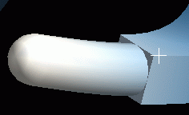{ width="200" .on-glb }
    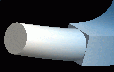{ width="200" .on-glb }
    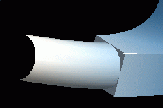{ width="200" .on-glb }

Segment-end fade out
:   セグメント末端をフェードアウトさせるかどうか

### Helix

ヘリックス部分の断面形状と、開始 (Tail) / 終了 (Head) 部分の接続形状の設定です。

Section type
:   断面の形状。下図左から **Elliptical** (楕円形)、**Rectangle** (四角)、
    **Round rectangle** (角なし四角)、**Fancy** (ダンベル型) 
    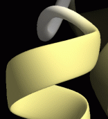{ .on-glb }
    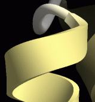{ .on-glb }
    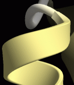{ .on-glb }
    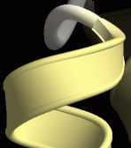{ .on-glb }

Back color
:   ヘリックスの内側の色。OFF だと内側も外側も同じ色になります。既定は OFF 
    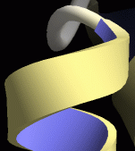{ .on-glb }

Width
:   ヘリックスの厚さ。単位は Å

Tuber
:   ヘリックスの幅。Width の何倍にするかで指定します

Sharpness
:   Section type により意味が変わります。 
    **Round rectangle** の場合は長方形の角の取れ具合。1 にするとほぼ角張った形状に、
    0 に近いとより丸みを帯びた形状になります。 
    **Fancy** の場合はダンベル型の両端の円の大きさ。0 に近い値にすると厚さが薄くなり
    縁が際立った形状に (下図左、値 = 0)、0.5 に近づくと Round rectangle に近い形状に
    (下図中央、値 = 0.5)、0.5 以上にすると下図右 (値 = 0.75) のような形状になります 
    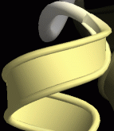{ .on-glb }
    { .on-glb }
    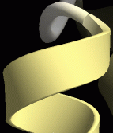{ .on-glb }

Smoothness
:   0 だとヘリックスが pivot atom (既定は Cα 原子) の位置を通る曲線になり、
    それ以下だと pivot atom を通らずになめらかな曲線になります

Head type / Tail type
:   ヘリックスの終了 (Head) / 開始 (Tail) 部分の形状。
    **Round** (滑らかに接続、下図左)、**Flat** (不連続、下図中央)、
    **Arrow** (矢型、下図右) 
    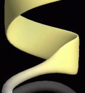{ .on-glb }
    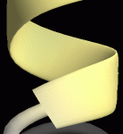{ .on-glb }
    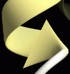{ .on-glb } 
    ヘリックスの末端を arrow にすることはほとんどありません。arrow 関連の設定は
    後述の [Sheet](#sheet) を参照してください

Head power / Tail power
:   接続の滑らかさ。下図は type が round の場合に値を 1、1.5、3 と変化させたもの
    (round の場合は 1 以下の値を指定しても意味がありません) 
    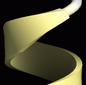{ .on-glb }
    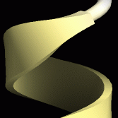{ .on-glb }
    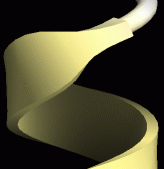{ .on-glb }

Head arrow height / width
:   type が arrow の場合のみ有効。矢の高さ・幅を指定します (→ [Sheet](#sheet))

### Sheet

ヘリックスと同じ設定項目があります。各設定の意味もヘリックスとほぼ同じなので、
[Helix](#helix) を参照してください。シートで意味が異なる設定のみ以下に示します。

Side color
:   シートの場合は、裏面ではなく**側面**の色が変わります 
    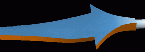{ .on-glb }

Smoothness
:   シートの場合、0 にするとうねりすぎるので既定は 0.5 です (伸びた β シートになる)。
    ただし側鎖を表示する場合は、0.5 だと側鎖が浮いたようになってしまうので
    0 に変更したほうがよいことがあります 
    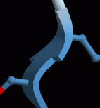{ .on-glb }
    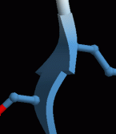{ .on-glb }
    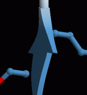{ .on-glb }

Head type = Arrow
:   β シートの先端が矢状になります (Tail を矢状にすることはほとんどありません)。
    このとき Head power は矢の先端のとがり具合に影響します。
    下図は右から 0.5、中央 1、左 2 の場合です 
    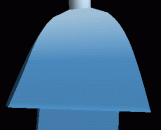{ .on-glb }
    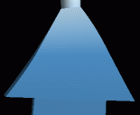{ .on-glb }
    { .on-glb }

Head arrow width
:   矢の先端部分の幅。100% にすると矢の幅はシート本体の幅の 3 倍になり、
    0% にすると幅はシート本体と同じ (= 矢の先端部分なし) になります

Head arrow height
:   矢の先端部分の高さ。値を減少させると矢の先端部の高さが減少します 
    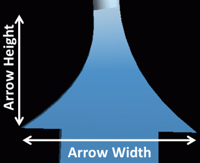{ width="320" .on-glb }

### Coil

コイル部分は Head / Tail の概念がないので、断面形状に関する設定項目のみです。
各設定の意味は [Helix](#helix) の断面に関する部分と同じです。

## 関連項目

- [Renderer の一覧](index.md)
- [cartoon](cartoon.md) — 円柱ヘリックスの二次構造表示
- [tube](tube.md) — 二次構造によらないチューブ表示
- [マテリアル](material.md) / [エッジライン](edge-lines.md)

---

*最終確認: 2026-08-11 / 確認対象: 開発版 (tritium)*
