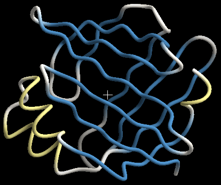
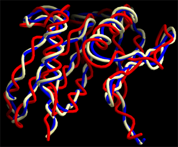
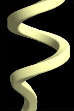
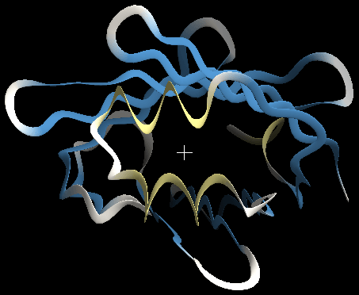
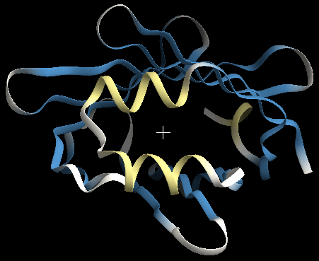
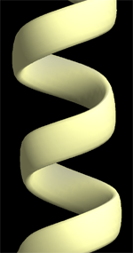
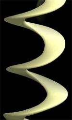
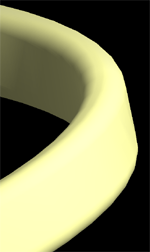
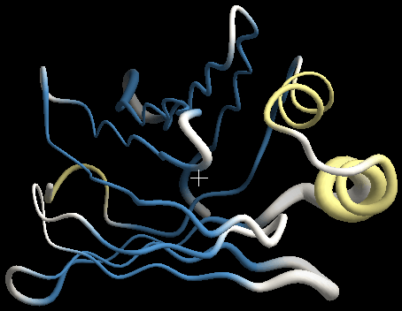

# tube

タンパク質や核酸の主鎖を、滑らかなチューブでつないで表示する Renderer です。
対象 Object: 分子 (MolCoord)。二次構造の割り当てによらず、一様なチューブで描画します。

{ width="320" .on-glb }

## プロパティ

共通プロパティは [Renderer 共通プロパティ](common.md) を参照してください。

### Tube

Axial detail
:   鎖方向のポリゴン分割数。大きい値ほど滑らかになりますが描画速度は低下します

Smoothness
:   0 だとチューブが pivot atom の位置を通る曲線になり、
    それ以下だと pivot atom を通らずになめらかな曲線になります

Smooth color
:   隣り合う残基間で色が異なる場合、ON だと残基間の着色がグラデーションになります

Pivot atom name
:   チューブが通る原子の名前。既定はタンパク質で CA (Cα 炭素原子) です。
    下図は pivot atom を変えた場合の比較です 
    { .on-glb }

Start / End type
:   末端の形状 (sphere / flat / none)

### Section

チューブの断面形状に関する設定です。

Type
:   断面の形状。既定は **elliptical** (楕円)。ほかに **round_square** (角がとれた長方形、下図左)、
    **rectangle** (角がとがった長方形、下図右) があります 
    { .on-glb }
    { .on-glb }

Detail
:   断面方向のポリゴン分割数。大きい値ほど滑らかな曲面になりますが負荷が大きくなります
    (下限は 2)。レンダリング後の画像が角ばって見える場合は、Axial detail とともに
    増やすと解消します

Width1, Width2
:   チューブの太さを Å 単位で指定します。Width1 が横方向、Width2 が縦方向の半径です。 
    左は Width1 (0.5 Å) > Width2 (0.1 Å)、右は Width1 (0.1 Å) < Width2 (0.5 Å) の場合
    (Type は elliptical) 
    { width="240" .on-glb }
    { width="240" .on-glb }

Tuber
:   チューブの扁平さ。法線方向と陪法線方向の太さの比率を指定します。
    1 以外にすることで楕円状の断面のチューブになります。 
    下図左は tuber = 3 (width = 0.35)、右は tuber = 0.3 (width = 1.16)。
    tuber < 1 を使うケースはあまりありません 
    { .on-glb }
    { .on-glb }

Sharpness
:   Type が round_square の場合のみ有効。角の取れ具合を指定します。
    1 にすると rectangle と同程度に角張った形状に、0 に近いと elliptical に近い形状に
    なります。下図左は 0.1、右は 0.9 
    { .on-glb }
    { .on-glb }

### Putty

Putty は B-factor などのパラメータに応じてチューブの太さを変える表示設定です。
パラメータの最大値で太さが High scale 倍に太くなり、最小値で太さが Low scale 分の 1 に
細くなります。その間の値を持つ部分は連続的 (線形補間) に変化します。

{ width="320" .on-glb }

Mode
:   **off** は putty を使用しません (太さ一定)。**Linear**、**Scaling** は
    Target に指定したパラメータに応じて太さを変化させます

Target
:   太さを変化させる対象。B-factor か Occupancy を選べます

Low scale
:   パラメータの最小値における太さのスケーリング値。最小のパラメータを持つ残基の部分で
    チューブの太さが Low scale 分の 1 に細くなります。既定では 1/3

High scale
:   パラメータの最大値における太さのスケーリング値。最大のパラメータを持つ残基の部分で
    チューブの太さが High scale 倍に太くなります。既定では 3 倍

## 関連項目

- [Renderer の一覧](index.md)
- [nucl](nucl.md) — 核酸用のチューブ + 塩基表示
- [spline](spline.md) — 線による平滑化主鎖表示
- [ribbon](ribbon.md) — 二次構造に応じたリボン表示
- [マテリアル](material.md) / [エッジライン](edge-lines.md)

---

*最終確認: 2026-08-11 / 確認対象: 開発版 (tritium)*
