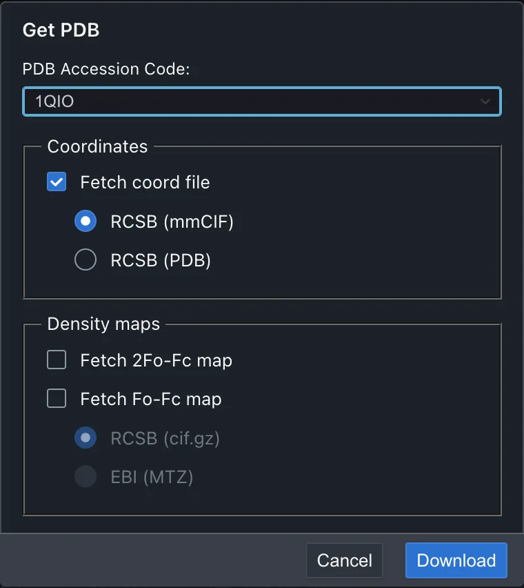
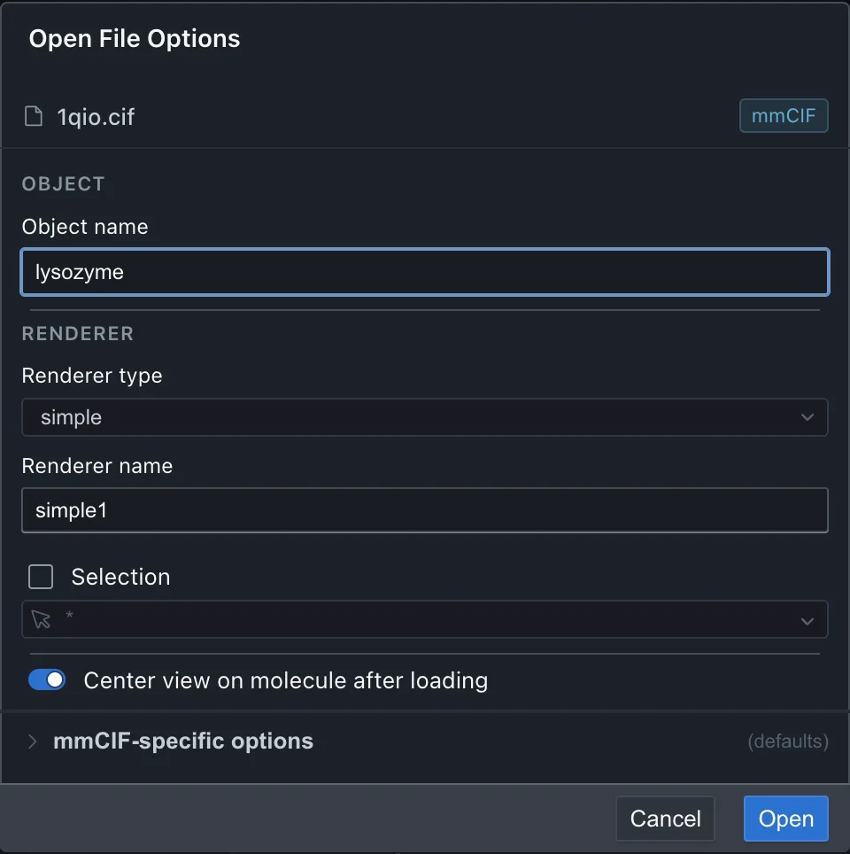
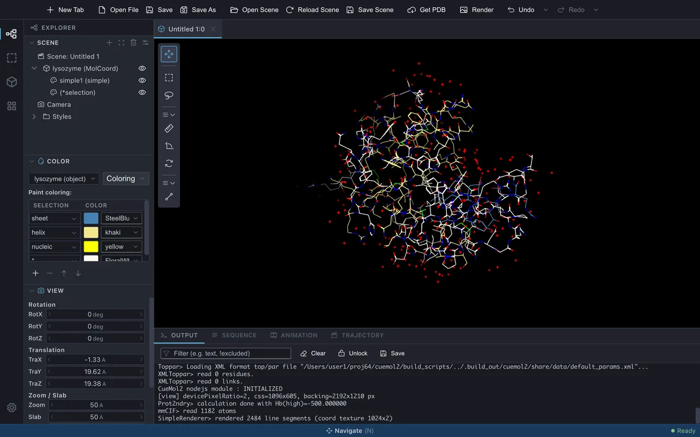
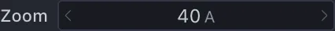
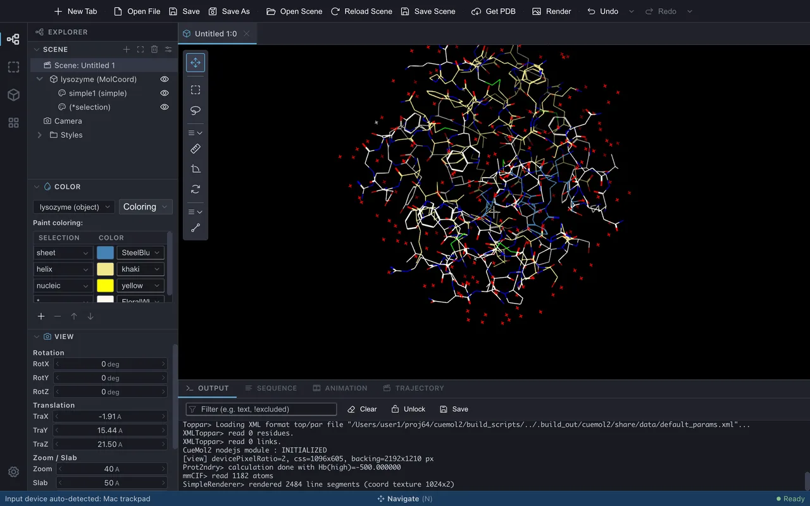
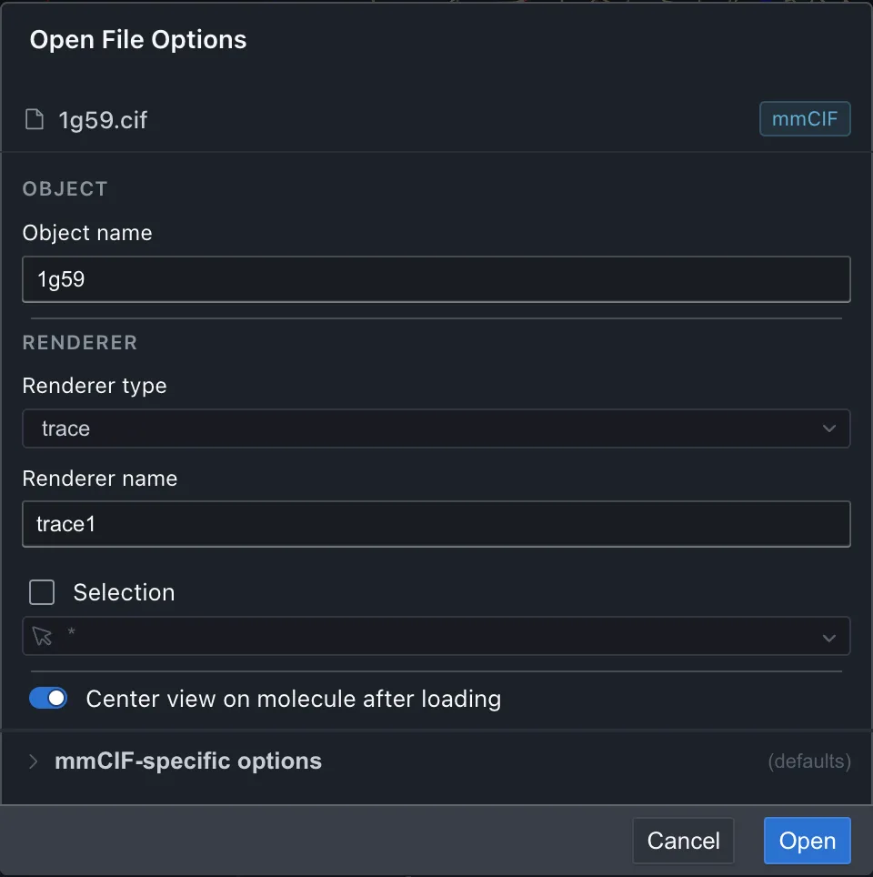
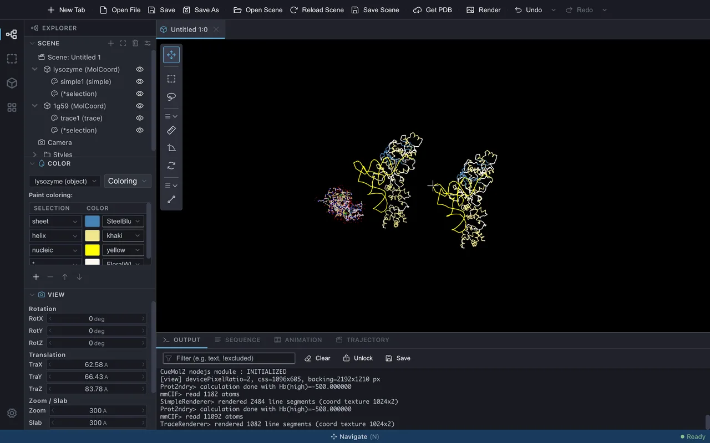
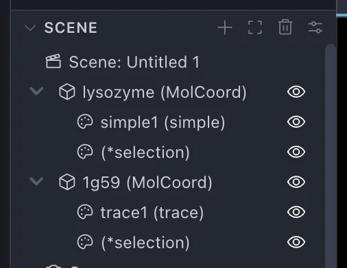

# 構造の読み込みと表示

分子構造を読み込んで表示するまでの操作と、CueMol3 の中心にある
**Scene / Object / Renderer** の考え方を学びます。
題材には 1.2 Å 分解能のリゾチームの結晶構造 (PDB ID: **1QIO**) を使います。

基本操作コースの各ページは、この順に進めると前のページの状態を引き継げます。

## 1. 構造を読み込む

**File &gt; Get PDB...** を開き、**PDB Accession Code** に `1QIO` と入力して取得します。
手元のファイルを開く場合は **File &gt; Open File...** (++cmd+o++) を使います
(→ [File メニュー](../../menu/file.md))。

{ width="380" .on-glb }

取得が終わると、**Open File Options** の画面が出ます。

1. **Object name** を `lysozyme` に変更します。読み込まれたデータは **Object** と呼ばれ、
   CueMol の中ではこの名前で識別されます (既定ではファイル名由来の名前が入っています)
2. **Renderer type** から **simple** を選びます
3. そのほかは既定のまま **Open** を押します

{ width="480" .on-glb }

分子が線画 (stick モデル) で表示されます。

{ .on-glb }

### Renderer type の種類

よく使う表示方法には次のようなものがあります。

simple
:   線画の stick モデル。軽く、細部を確認する用途に向きます

trace
:   Cα (タンパク質) / リン原子 (核酸) を直線でつないだ最も軽い表示

ballstick
:   原子を球、結合を円柱で描くモデル

cpk
:   空間充填モデル

tube
:   主鎖を滑らかなチューブで描く表示

ribbon / cartoon
:   二次構造を反映したリボン表示。cartoon はヘリックスを筒状に描きます

nucl
:   核酸向けの主鎖チューブ + 塩基表示

全種類の一覧と詳細は [Renderer 一覧](../../reference/renderers/index.md) を参照してください。

### そのほかのオプション

- **Center view on molecule after loading** — 読み込んだ分子へ視点を移します。
  現在の視点を保ちたいときはチェックを外します
- **Selection** — 表示する範囲をあらかじめ選択式で絞れます。読み込み自体は
  分子全体に対して行われます

## 2. 視点を操作する

読み込んだ分子を、いろいろな向きから眺めてみます。

1. 分子ビュー上を**左ドラッグ**します。ドラッグした向きに分子が回転します
2. **ホイール**を回します。分子が拡大・縮小します
3. 左サイドパネルの **Explorer &gt; View** パネルで、**Zoom / Slab** の **Zoom** の値を
   クリックし、`40` と入力して ++enter++ を押します

    { width="150" }

Zoom は分子ビューに映す範囲の高さ (Å) です。値を小さくすると、その分だけ分子が
大きく表示されます。マウスで動かすより正確に視点を合わせたいときに使います。

{ .on-glb }

平行移動やスラブ (手前と奥を切り抜いて表示する範囲) の操作を含めた一覧は
[マウス・トラックパッド操作](../../ui/mouse-input.md)、View パネルの各項目は
[サイドパネル](../../ui/side-panels.md) を参照してください。

原子の上でクリックすると、その原子の名前がラベルとして表示されます
(もう一度クリックすると消えます)。右クリックすると、分子名・チェイン・残基・原子の
情報がメニューの先頭に表示され、**Center at this atom** でその原子を
ビュー中央に移せます。

## 3. もう 1 つ分子を読み込む

同じシーンには複数の Object を読み込めます。ここでは `1G59`
(グルタミル tRNA 合成酵素と tRNA の複合体) を追加します。

1. **File &gt; Get PDB...** を開き、**PDB Accession Code** に `1G59` と入力して
   **Download** を押します
2. **Renderer type** から **trace** を選びます

    { width="480" .on-glb }

3. **Object name** は既定のまま (`1g59`) にして **Open** を押します

タンパク質は Cα 原子、核酸はリン原子だけをつないだ軽量な表示で描かれます。1G59 の
非対称単位には複合体が 2 組 (タンパク質 2 本 + tRNA 2 本) 入っているので、同じ形が
2 つ現れます。

読み込むと視点は新しい分子へ移る (**Center view on molecule after loading** が既定でオン)
ため、この時点ではリゾチームは見えません。両方を同時に見るには、§2 と同じ要領で View
パネルの 2 つの値を広げます。

1. **Zoom** に `300` と入力します
2. **Slab** に `300` と入力します

Zoom だけを広げても見えるようにはなりません。**Slab** (奥行き方向に表示する厚み) が
既定の 50 Å のままだと、1G59 から 100 Å ほど離れた位置にあるリゾチームは奥行きで
切り落とされてしまうためです。両方を広げると、1G59 の複合体 2 組と、その左側に
小さくリゾチームが入ります。

{ .on-glb }

特定の Object だけを見たいときは、シーンツリーでその行を選び、パネル上部の **Focus**
ボタンを押します。その Object に合わせて Zoom と Slab が自動で調整されます。

## 4. Scene・Object・Renderer・View

ここまでに登場した概念を整理します。

Object
:   分子座標・電子密度・静電ポテンシャルなどの**データ**。それ自身は画面に現れません

Renderer
:   Object を画面に**表示する**役割。1 つの Object に複数の Renderer を付けられるので、
    同じ分子を ribbon と ballstick で同時に表示する、といったことができます

Scene
:   Object と Renderer をまとめた 1 つの作業単位。ウィンドウ上部の**タブ**が
    シーンに対応し、複数のシーンを開いても互いに干渉しません

View
:   シーンを映す画面 (分子ビュー) のこと。1 つのシーンに複数の View を
    接続することもできます (→ [File メニュー](../../menu/file.md) の New Tab)

## 5. シーンツリーで全体を把握する

左サイドパネルの **Explorer &gt; Scene** ツリー (シーンツリー) には、シーン内の
Object とその配下の Renderer が階層で表示されます (→ [サイドパネル](../../ui/side-panels.md))。

- いまは `lysozyme` と `1g59` の 2 つの Object があり、それぞれに simple / trace の
  Renderer が付いています (Get PDB で読み込むと、Object 名は PDB ID の小文字になります)
- 分子を読み込むと、選択部分をハイライト表示するための `*selection` という
  Renderer も自動で作られます
- 行の**目のアイコン**で Renderer の表示・非表示を切り替えられます。Object 行で
  切り替えると、配下の Renderer がまとめて切り替わります
- 不要になった Object や Renderer は、行を選んでパネル上部の **Delete** ボタンで
  削除できます (Undo で戻せます)

{ width="237" .on-glb }

## 次のステップ

- [分子の一部を選択する](selection.md) — 操作対象を選ぶ方法
- [マウス・トラックパッド操作](../../ui/mouse-input.md) / [サイドパネル](../../ui/side-panels.md)

---

*確認対象: CueMol3 2.3.8.495*
