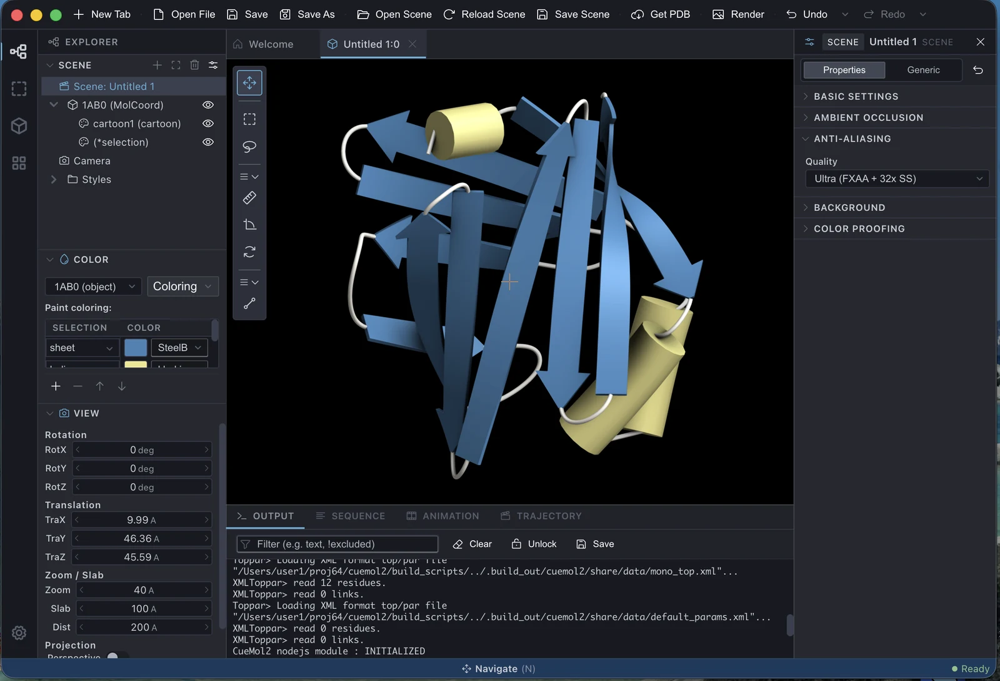

# 画面構成

CueMol3 のメインウィンドウは、単一のウィンドウにすべての操作面をまとめた構成です。
CueMol2 のように機能ごとに別ウィンドウが開くことはありません。

## 領域の名称

図中の番号が下表の # に対応します。

{ .on-glb }

| # | 領域 | 役割 | 詳細 |
|---|---|---|---|
| 1 | **ツールバー** | よく使う操作 (新規タブ / ファイル操作 / Get PDB / Render / Undo・Redo) のボタン | [ツールバーとツールパレット](toolbar-tools.md) |
| 2 | **アクティビティバー** | 左端の縦アイコン列。サイドパネルに表示する内容 (Explorer / Selection / Crystal など) を切り替えます。最下部の歯車は Settings タブを開きます | [サイドパネル](side-panels.md) |
| 3 | **サイドパネル (左)** | アクティビティバーで選んだ用途のパネル群。シーンツリー・色設定・分子構造ツリーなど | [サイドパネル](side-panels.md) |
| 4 | **タブバー** | 開いているシーン / ビュー、および Settings タブの切り替え。ドラッグで並べ替えできます | |
| 5 | **レンダリングビュー** | 3D 表示の本体。マウス操作で視点を動かします | [レンダリングウィンドウ](rendering-window.md) / [マウス・トラックパッド操作](mouse-input.md) |
| 6 | **ツールパレット** | 3D ビュー左端に浮かぶ縦のツールボタン列。視点操作 / 範囲選択 / 計測 / 結合編集のモードを切り替えます | [ツールバーとツールパレット](toolbar-tools.md) |
| 7 | **プロパティインスペクタ (右)** | シーンツリーで選んだ要素の設定を表示・編集します。変更は 3D ビューに即座に反映されます | [プロパティインスペクタ](inspector.md) |
| 8 | **下部パネル** | Output (ログ) / Sequence (配列) / Animation (タイムライン) / Trajectory (MD) のタブ | [下部パネル](bottom-panels.md) |
| 9 | **ステータスバー** | 状態表示 | |
| — | **メニューバー** | File / Edit などのメニュー。macOS では画面上部のシステムメニューバーにあるため図には写っていません。Windows / Linux ではウィンドウ内の上部にあります | [メニュー](../menu/index.md) |

## タブ

CueMol3 では、シーンやビューは**タブ**として並びます。

- **File &gt; New Tab** で、新規シーンのタブ、または既存シーンの別ビューのタブを追加できます。
- タブはドラッグで並べ替えられます。
- Settings もタブとして開きます (アプリ内に 1 つだけ)。

!!! info "CueMol2 の複数ウィンドウとの違い"
    CueMol2 の File &gt; New Window に相当する機能はありません。
    1 つのバックエンドを共有する構造上、複数の OS ウィンドウを開けないためです。
    代わりに **New Tab** を使ってください
    (→ [機能の統合・改名・廃止](../changes/features.md))。

## パネルの表示・非表示とサイズ

- アクティビティバーの**選択中のアイコンをもう一度クリック**するとサイドパネルが閉じます。
  再度クリックすると開きます。
- サイドパネル内の各パネルはヘッダをクリックして折りたたみ・展開できます。
- パネルの境界をドラッグしてサイズを変更できます。サイズは記憶されます。

## もう 1 つのウィンドウ

レイトレーシングや動画出力を行う**レンダリングウィンドウ**は、メインウィンドウとは独立した
トップレベルウィンドウとして開きます。モードレスなので、開いたままメインウィンドウで
3D ビューを操作できます (→ [レンダリングウィンドウ](rendering-window.md))。

ウィンドウの切り替えは **Window** メニューから行えます
(→ [Window / Help メニュー](../menu/window-help.md))。

---

*最終確認: 2026-08-10 / 確認対象: 開発版 (tritium)*
